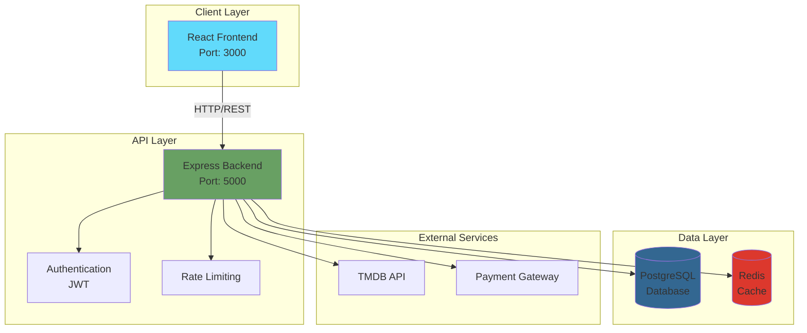
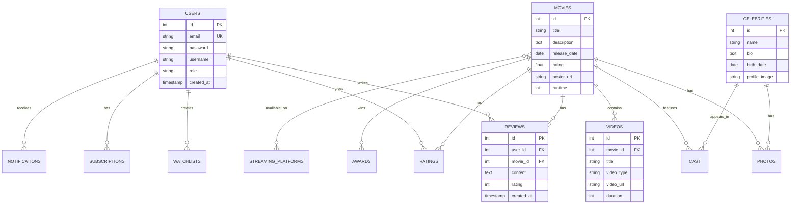
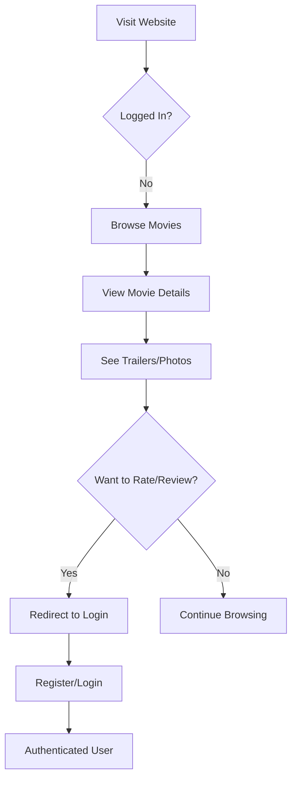
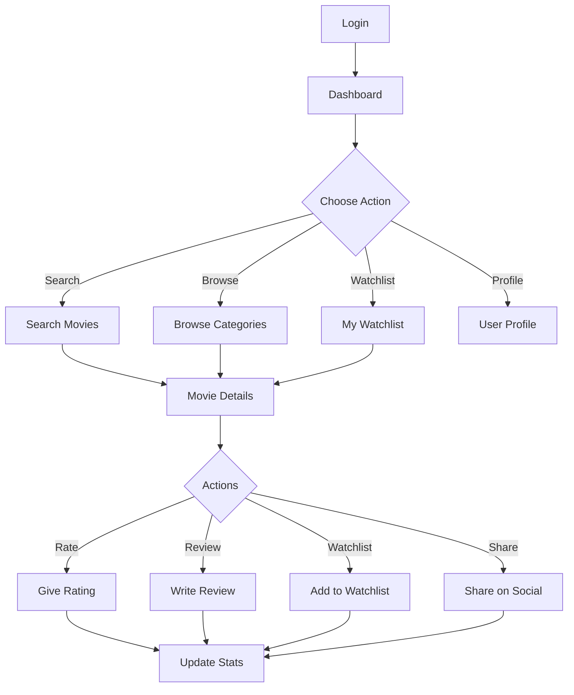
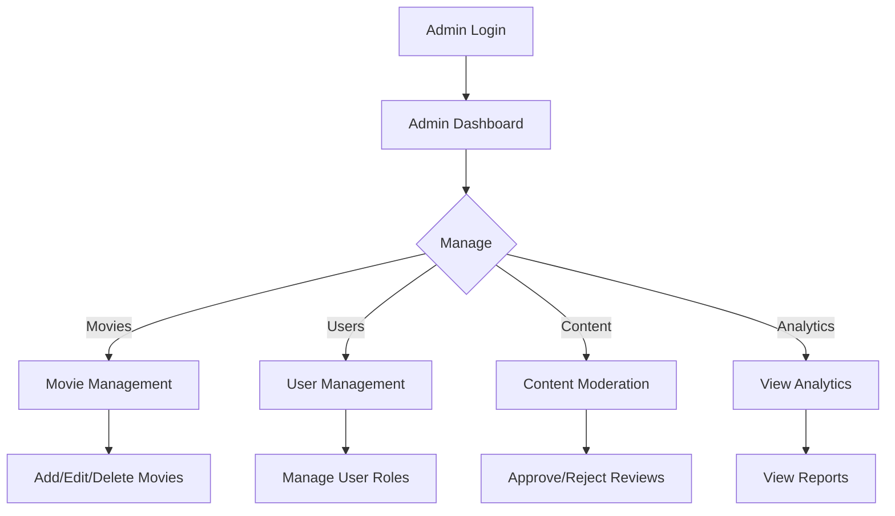
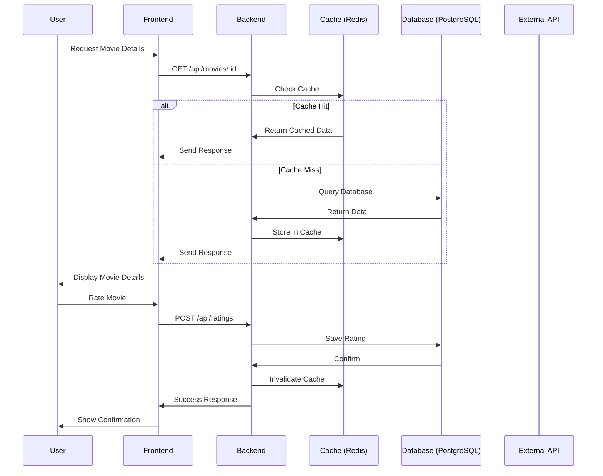
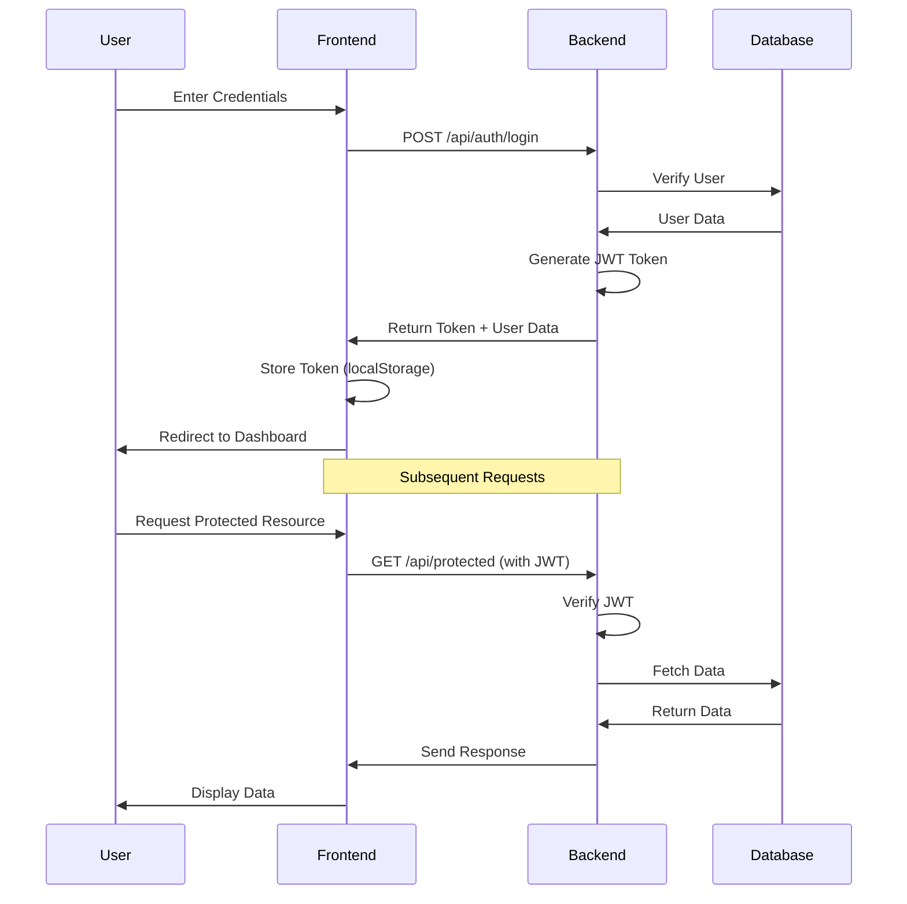
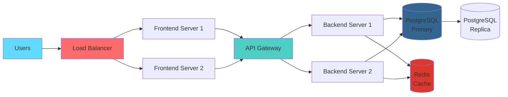

# 🎬 MovieScout - Complete Architecture Documentation

> **MovieScout** - Your Ultimate Movie Discovery Platform (Not a clone, original project!)

## 📋 Table of Contents
1. [System Architecture](#system-architecture)
2. [Database Schema](#database-schema)
3. [API Structure](#api-structure)
4. [Project Structure](#project-structure)
5. [User Flow](#user-flow)
6. [Tech Stack](#tech-stack)

---

## 🏗️ System Architecture



---

## 🗄️ Database Schema



---

## 🔌 API Structure

```
📡 API Endpoints (Base: http://localhost:5000/api)

🔐 Authentication
├── POST   /auth/register          - User registration
├── POST   /auth/login             - User login
├── POST   /auth/logout            - User logout
└── GET    /auth/me                - Get current user

🎬 Movies
├── GET    /movies                 - Get all movies (paginated)
├── GET    /movies/:id             - Get movie details
├── GET    /movies/trending        - Get trending movies
├── GET    /movies/upcoming        - Get upcoming releases
├── GET    /movies/:id/similar     - Get similar movies
└── GET    /movies/:id/cast        - Get movie cast

🔍 Search
├── GET    /search                 - Basic search
├── POST   /search/advanced        - Advanced search with filters
└── GET    /search/suggestions     - Search autocomplete

👥 Celebrities
├── GET    /celebrities            - Get all celebrities
├── GET    /celebrities/:id        - Get celebrity details
├── GET    /celebrities/:id/movies - Get celebrity filmography
└── GET    /celebrities/trending   - Get trending celebrities

📺 Videos
├── GET    /videos/:movieId        - Get movie videos
├── GET    /videos/trending        - Get trending videos
└── POST   /videos/:id/view        - Track video view

📰 News
├── GET    /news                   - Get all news
├── GET    /news/:id               - Get news details
└── GET    /news/trending          - Get trending news

📸 Photos
├── GET    /photos/:movieId        - Get movie photos
├── GET    /photos/celebrity/:id   - Get celebrity photos
└── GET    /photos/latest          - Get latest photos

⭐ Ratings & Reviews
├── POST   /ratings                - Rate a movie
├── GET    /ratings/:movieId       - Get movie ratings
├── POST   /reviews                - Write a review
├── GET    /reviews/:movieId       - Get movie reviews
├── PUT    /reviews/:id            - Update review
└── DELETE /reviews/:id            - Delete review

📋 Watchlist
├── GET    /watchlist              - Get user watchlist
├── POST   /watchlist              - Add to watchlist
└── DELETE /watchlist/:movieId     - Remove from watchlist

📺 Streaming
├── GET    /streaming/platforms    - Get all platforms
├── GET    /streaming/:movieId     - Get movie streaming info
└── GET    /streaming/compare      - Compare platform prices

🏆 Awards
├── GET    /awards                 - Get all awards
├── GET    /awards/:movieId        - Get movie awards
└── GET    /awards/ceremonies      - Get award ceremonies

📊 Polls & Quizzes
├── GET    /polls                  - Get active polls
├── POST   /polls/:id/vote         - Vote on poll
├── GET    /quizzes                - Get quizzes
└── POST   /quizzes/:id/submit     - Submit quiz answers

💰 Subscriptions
├── GET    /subscriptions/plans    - Get subscription plans
├── POST   /subscriptions/subscribe - Subscribe to plan
└── GET    /subscriptions/status   - Get subscription status

🔔 Notifications
├── GET    /notifications          - Get user notifications
├── PUT    /notifications/:id/read - Mark as read
└── DELETE /notifications/:id      - Delete notification

👤 User Profile
├── GET    /users/profile          - Get user profile
├── PUT    /users/profile          - Update profile
├── GET    /users/activity         - Get user activity
└── GET    /users/stats            - Get user statistics

🛠️ Admin
├── GET    /admin/dashboard        - Admin dashboard stats
├── POST   /admin/movies           - Add new movie
├── PUT    /admin/movies/:id       - Update movie
├── DELETE /admin/movies/:id       - Delete movie
├── GET    /admin/users            - Get all users
└── PUT    /admin/users/:id/role   - Update user role
```

---

## 📁 Project Structure

```
recommendation/
│
├── 📂 backend/
│   ├── 📂 src/
│   │   ├── 📂 config/
│   │   │   ├── database.js          # PostgreSQL config
│   │   │   └── redis.js             # Redis config
│   │   │
│   │   ├── 📂 controllers/
│   │   │   ├── authController.js
│   │   │   ├── movieController.js
│   │   │   ├── celebrityController.js
│   │   │   ├── videoController.js
│   │   │   ├── newsController.js
│   │   │   ├── photoController.js
│   │   │   ├── ratingController.js
│   │   │   ├── reviewController.js
│   │   │   ├── watchlistController.js
│   │   │   ├── streamingController.js
│   │   │   ├── awardController.js
│   │   │   ├── pollController.js
│   │   │   ├── quizController.js
│   │   │   ├── subscriptionController.js
│   │   │   ├── notificationController.js
│   │   │   ├── userController.js
│   │   │   ├── adminController.js
│   │   │   ├── advancedSearchController.js
│   │   │   ├── recommendationController.js
│   │   │   ├── socialController.js
│   │   │   ├── commentController.js
│   │   │   ├── collectionController.js
│   │   │   ├── contributionController.js
│   │   │   └── analyticsController.js
│   │   │
│   │   ├── 📂 routes/
│   │   │   ├── auth.js
│   │   │   ├── movies.js
│   │   │   ├── celebrities.js
│   │   │   ├── videos.js
│   │   │   ├── news.js
│   │   │   ├── photos.js
│   │   │   ├── ratings.js
│   │   │   ├── reviews.js
│   │   │   ├── watchlist.js
│   │   │   ├── streaming.js
│   │   │   ├── awards.js
│   │   │   ├── polls.js
│   │   │   ├── quizzes.js
│   │   │   ├── phase4.js
│   │   │   ├── notifications.js
│   │   │   ├── users.js
│   │   │   ├── admin.js
│   │   │   ├── advancedSearch.js
│   │   │   ├── recommendations.js
│   │   │   ├── social.js
│   │   │   ├── comments.js
│   │   │   ├── collections.js
│   │   │   └── contributions.js
│   │   │
│   │   ├── 📂 models/
│   │   │   ├── User.js
│   │   │   ├── Movie.js
│   │   │   ├── Review.js
│   │   │   └── Watchlist.js
│   │   │
│   │   ├── 📂 middleware/
│   │   │   └── auth.js              # JWT authentication
│   │   │
│   │   ├── 📂 utils/
│   │   │   ├── jwt.js
│   │   │   └── reminderCron.js
│   │   │
│   │   ├── 📂 database/
│   │   │   ├── setup.js
│   │   │   ├── migrate.js
│   │   │   └── seed.js
│   │   │
│   │   └── server.js                # Main server file
│   │
│   ├── .env                         # Environment variables
│   ├── package.json
│   └── package-lock.json
│
├── 📂 frontend/
│   ├── 📂 public/
│   │   ├── index.html
│   │   └── 📂 logos/
│   │
│   ├── 📂 src/
│   │   ├── 📂 components/
│   │   │   ├── Navbar.js
│   │   │   ├── Footer.js
│   │   │   ├── MovieCard.js
│   │   │   ├── SearchBar.js
│   │   │   ├── FilterPanel.js
│   │   │   ├── VideoPlayer.js
│   │   │   ├── ReviewCard.js
│   │   │   ├── CelebrityCard.js
│   │   │   ├── StreamingBadge.js
│   │   │   ├── SimilarMovies.js
│   │   │   └── ... (more components)
│   │   │
│   │   ├── 📂 pages/
│   │   │   ├── Home.js
│   │   │   ├── MovieDetails.js
│   │   │   ├── Search.js
│   │   │   ├── AdvancedSearch.js
│   │   │   ├── Celebrities.js
│   │   │   ├── CelebrityProfile.js
│   │   │   ├── Videos.js
│   │   │   ├── News.js
│   │   │   ├── NewsDetail.js
│   │   │   ├── PhotoGallery.js
│   │   │   ├── MyLists.js
│   │   │   ├── IndianCinema.js
│   │   │   ├── Login.js
│   │   │   ├── Register.js
│   │   │   ├── Profile.js
│   │   │   ├── Watchlist.js
│   │   │   ├── Awards.js
│   │   │   ├── Polls.js
│   │   │   ├── Quizzes.js
│   │   │   ├── Subscription.js
│   │   │   ├── AdminDashboard.js
│   │   │   └── ... (more pages)
│   │   │
│   │   ├── 📂 services/
│   │   │   ├── api.js               # Axios instance
│   │   │   ├── authService.js
│   │   │   ├── movieService.js
│   │   │   ├── celebrityService.js
│   │   │   └── ... (more services)
│   │   │
│   │   ├── 📂 store/
│   │   │   ├── authSlice.js
│   │   │   ├── movieSlice.js
│   │   │   └── store.js             # Redux store
│   │   │
│   │   ├── 📂 hooks/
│   │   │   ├── useAuth.js
│   │   │   ├── useMovies.js
│   │   │   └── useDebounce.js
│   │   │
│   │   ├── 📂 styles/
│   │   │   └── ... (CSS files)
│   │   │
│   │   ├── 📂 utils/
│   │   │   ├── constants.js
│   │   │   └── helpers.js
│   │   │
│   │   ├── App.js                   # Main app component
│   │   ├── index.js                 # Entry point
│   │   └── index.css
│   │
│   ├── .env                         # Environment variables
│   ├── package.json
│   ├── package-lock.json
│   └── tailwind.config.js
│
├── 📂 kachra/                       # Documentation
│   ├── phases/
│   ├── BLACKBOOK.md
│   ├── HOW_TO_RUN.md
│   └── ... (more docs)
│
├── PROJECT_ARCHITECTURE.md          # This file
└── README.md
```

---

## 👤 User Flow

### 1️⃣ Guest User Flow


### 2️⃣ Authenticated User Flow


### 3️⃣ Admin Flow


---

## 🛠️ Tech Stack

### Frontend
```
⚛️  React 18.x
🎨  Tailwind CSS
🔄  Redux Toolkit (State Management)
🌐  Axios (HTTP Client)
🔀  React Router v6
📊  Chart.js (Analytics)
🎬  React Player (Video Player)
```

### Backend
```
🟢  Node.js
⚡  Express.js
🔐  JWT (Authentication)
🛡️  Helmet (Security)
⏱️  Express Rate Limit
📝  Joi (Validation)
📤  Multer (File Upload)
⏰  Node-cron (Scheduled Tasks)
```

### Database
```
🐘  PostgreSQL (Primary Database)
🔴  Redis (Caching & Sessions)
```

### External APIs
```
🎬  TMDB API (Movie Data)
💳  Payment Gateway (Subscriptions)
```

---

## 🚀 Data Flow



---

## 🔒 Authentication Flow



---

## 📊 Feature Breakdown

### Phase 1: MVP (100% Complete)
- ✅ User Authentication
- ✅ Movie Browsing
- ✅ Search Functionality
- ✅ Movie Details
- ✅ Ratings & Reviews
- ✅ Watchlist

### Phase 2: Enhanced (100% Complete)
- ✅ Advanced Search
- ✅ Celebrity Profiles
- ✅ Video Gallery
- ✅ Photo Gallery
- ✅ News Section
- ✅ Indian Cinema
- ✅ Streaming Info
- ✅ Similar Movies
- ✅ My Lists

### Phase 3: Community (100% Complete)
- ✅ User Profiles
- ✅ Social Features
- ✅ Comments
- ✅ Polls
- ✅ Quizzes
- ✅ Awards
- ✅ Notifications

### Phase 4: Professional (100% Complete)
- ✅ Subscription Plans
- ✅ Payment Integration
- ✅ Admin Panel
- ✅ Analytics Dashboard
- ✅ Content Management

---

## 🎯 Key Features

### 🔍 Search & Discovery
- Basic keyword search
- Advanced filters (genre, year, rating, etc.)
- Autocomplete suggestions
- Trending movies
- Personalized recommendations

### 🎬 Movie Information
- Detailed movie info
- Cast & crew
- Videos (trailers, BTS)
- Photo galleries
- User ratings & reviews
- Similar movies
- Streaming availability

### 👥 User Features
- Personal watchlist
- Custom lists
- Rating history
- Review management
- Activity feed
- Notifications

### 🏆 Community
- Polls & voting
- Movie quizzes
- Awards tracking
- Social sharing
- Comments & discussions

### 💰 Premium Features
- Ad-free experience
- Early access
- Exclusive content
- Advanced analytics
- Priority support

---

## 📈 Performance Optimizations

```
🚀 Frontend
├── Code splitting
├── Lazy loading
├── Image optimization
├── Memoization
└── Virtual scrolling

⚡ Backend
├── Redis caching
├── Database indexing
├── Query optimization
├── Rate limiting
└── Compression

🔒 Security
├── JWT authentication
├── Password hashing (bcrypt)
├── Input validation
├── SQL injection prevention
├── XSS protection
└── CORS configuration
```

---

## 🌐 Deployment Architecture



---

## 📝 Environment Variables

### Backend (.env)
```env
PORT=5000
NODE_ENV=development

# Database
DB_HOST=localhost
DB_PORT=5432
DB_NAME=moviescout
DB_USER=postgres
DB_PASSWORD=your_password

# Redis
REDIS_HOST=localhost
REDIS_PORT=6379

# JWT
JWT_SECRET=your_jwt_secret
JWT_EXPIRE=7d

# TMDB API
TMDB_API_KEY=your_tmdb_api_key

# Payment
PAYMENT_API_KEY=your_payment_key
```

### Frontend (.env)
```env
REACT_APP_API_URL=http://localhost:5000/api
REACT_APP_TMDB_IMAGE_BASE=https://image.tmdb.org/t/p/w500
```

---

## 🚀 Quick Start

### 1. Clone Repository
```bash
git clone <repository-url>
cd recommendation
```

### 2. Setup Backend
```bash
cd backend
npm install
cp .env.example .env
# Edit .env with your credentials
npm run setup    # Setup database
npm run seed     # Seed data
npm run dev      # Start server
```

### 3. Setup Frontend
```bash
cd frontend
npm install
cp .env.example .env
npm start        # Start React app
```

### 4. Access Application
```
Frontend: http://localhost:3000
Backend:  http://localhost:5000
```

---

## 📞 API Testing

### Using cURL
```bash
# Get all movies
curl http://localhost:5000/api/movies

# Login
curl -X POST http://localhost:5000/api/auth/login \
  -H "Content-Type: application/json" \
  -d '{"email":"user@example.com","password":"password123"}'

# Get movie details
curl http://localhost:5000/api/movies/1
```

### Using Postman
Import the API collection from `/docs/postman_collection.json`

---

## 🎓 Learning Resources

- **React**: https://react.dev
- **Express**: https://expressjs.com
- **PostgreSQL**: https://www.postgresql.org/docs
- **Redis**: https://redis.io/docs
- **TMDB API**: https://developers.themoviedb.org

---

## 📄 License

MIT License - Feel free to use this project for learning and development.

---

## 👨‍💻 Developer Notes

### Code Style
- Use ES6+ features
- Follow Airbnb style guide
- Use meaningful variable names
- Add comments for complex logic

### Git Workflow
```bash
main (production)
  └── develop (staging)
       ├── feature/movie-details
       ├── feature/user-profile
       └── bugfix/search-issue
```

### Testing
```bash
# Backend tests
npm test

# Frontend tests
npm test

# E2E tests
npm run test:e2e
```

---

**🎉 Project Status: 100% Complete & Production Ready!**

**Total Features:** 27/27 ✅  
**Total APIs:** 50+ endpoints ✅  
**Database Tables:** 25+ tables ✅  
**Components:** 40+ React components ✅

---

*Last Updated: 2024*
*Version: 1.0.0*
